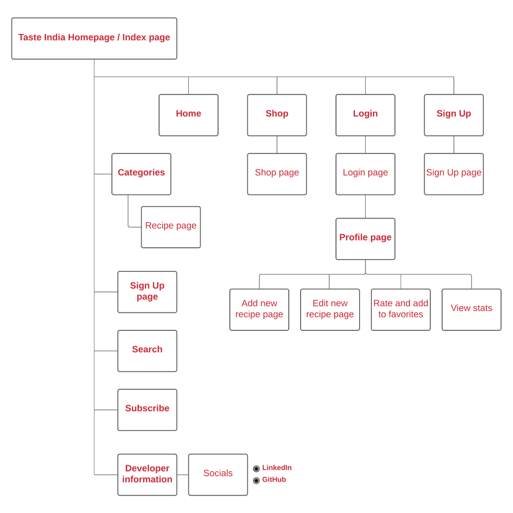

<h1 align="center">
     
</h1>

Taste India is a recipe website that has the secrets of traditional Indian home cooking that is made easy to recreate and will inspire you to cook delicious dishes and incorporate into your menu plan.

Explore the huge selection of recipes in variety of categories which are made easily searchable.

The users can create an account to add, edit and delete and can also rate and add to favourites their saved recipes.

Taste India is designed to easily navigate and is accessible on all devices. 

**Happy cooking**!

[View the live project here](http://taste-india-app.herokuapp.com/)

## Table of contents

1.  [UX Experience](#ux)
    - [Project Goals](#project-goals)
    - [User Stories](#user-stories)
    - [Development Planes](#Development-Planes)
    - [Wireframes](#wireframes)
    - [Views and Data Structure](#views-and-data-structure)
    - [Design](#design)
      - [Typography](#typography)
      - [Color Scheme](#color-scheme)
2.   [Features](#features)
     - [Existing Features](#existing-features)
      - [Account Registration](#account-registration)
      - [User Session](#user-session)
      - [About Page](#about-page)
      - [Create New Entries](#create-new-entries)
      - [List and Search Entries](#list-and-search-entries)
      - [View, Edit, and Delete Entries](#view-edit-and-delete-entries)
      - [Profile and Account Management](#profile-and-account-management)
      - [Send Feedback](#send-feedback)
      - [Security](#security)
    - [Features to Implement in the future](#features-to-implement-in-the-future)
3.  [Issues and Bugs](#Issues-and-Bugs) 
4.  [Technologies Used](#technologies-used)
5.  [Tools Used](#tools-used)
6.  [Testing](#testing)
7.  [Deployment](#deployment)
    - [Local Deployment](#local-deployment)
    - [Deployment to Heroku](#deployment-to-heroku)
8.  [Credits](#credits)
    - [Media](#media)
    - [Acknowledgements](#acknowledgements)

***

***

## UX 
### Project Goals
The primary goal of this project is to make a website that is intuitive and easy to navigate and allows users to use the CRUD (create, read, update and delete) functionality for their recipes.This website serves as a platform where users can get inspiration to cook traditional Indian recipes and recreate them.The main requirements were to design, develop and implement the website using **HTML**, **CSS**, **JavaScript**, **Python+Flask** and **MongoDB**.The secondary goals are to sell different kitchen tools and recipe books and access the statistics on dashboard which offers insight into daily inputs.

### User Stories
**As a visitor, I want to:**

-   Easily access the website on desktop, mobile and tablet.
-   Navigate and browse easily through the website that needs no instructions.
-   Explore all recipes and browse different categories.
-   Search recipes by category and select them.
-   Use the search functionality to find easily by recipe name, ingredients and other related keywords.
-   Signup and register, login to access the account profile.
-   Subscribe for a newsletter.
-   Shop for kitchen tools and recipe books.

**As a user, I want to:** 

-   Signup with a username and password to register on the website.
-   Login to my profile to add and access my recipes.
-   Add my own recipes , so they also appear on my account page.
-   Upload recipe images from computer or image links from Google.
-   Edit my recipes to update information of my recipes.
-   Delete my recipes if it is no longer relevant.
-   Rate my recipes, so that I can remember what I thought of it later or to update if I change my opinion.
-   Add to favourites, so that I remember what my favourites are on my account page.
-   Logout of my profile after managing my recipes.

**As a admin, I want to:**

-  Access all goals of visitors, users and also manage different categories.
-  Manage different categories by adding, editing and deleting all recipes.
-  View statistics on dashboard to keep tracks of number of users and recipes.

**Developer / Site Owner Goals:**
The Developer is looking to:
- Create inspiring , easy to use intuitive website where the user can browse, add, edit, delete, rate and add to favourites recipes.
- Demonstrate and improve their proficiency in a variety of software development skills, using newly learned languages, libraries and API’s.
- Deploy a project and have it on their portfolio.

### Development Planes

The **Five Development Planes** explain the functionality of user experience design focusing on user accessibility and friendliness which helps both users and developer achieve their goals.

<strong>1. <u>Strategy</u></strong>

The following three categories helps focus on the following target audiences:

- **Roles:**
     - First time visitors
     - New users
     - Registered users

- **Demographic:**
     - Food enthusiasts
     - Aged 18 years and up
     - Culinarian 

- **Psychographics:**
     - Personalities & Attitudes:
          - Creative
          - Know cookery basics
          - Joyful
          - Easy-going
     - Values:
          - Both modern and traditional lifestyle
          - Holistic thinking
          - Health enthusiast
          - Loves authentic home cooking
     - Lifestyles:
          - Home cooks
          - Hobbyist chefs
          - Food bloggers
          - Cuisine connoisseurs

The **user** will be able to:
- Navigate and browse easily through the website without any instructions
- Select their preferred food category
- Login to create account
- Add and save recipes
- Edit and delete recipes
- Rate and add to favourites their own recipes
- Find recipes using keywords in search functionality
- Subscribe to newsletter
- Connect with developer through social links

The **admin** will be able to:
- Access what users are able to
- Add, edit and delete all recipes on the website
- Communicate with users on social links

A strategy table describes the user and admin goals between importance and feasibility

