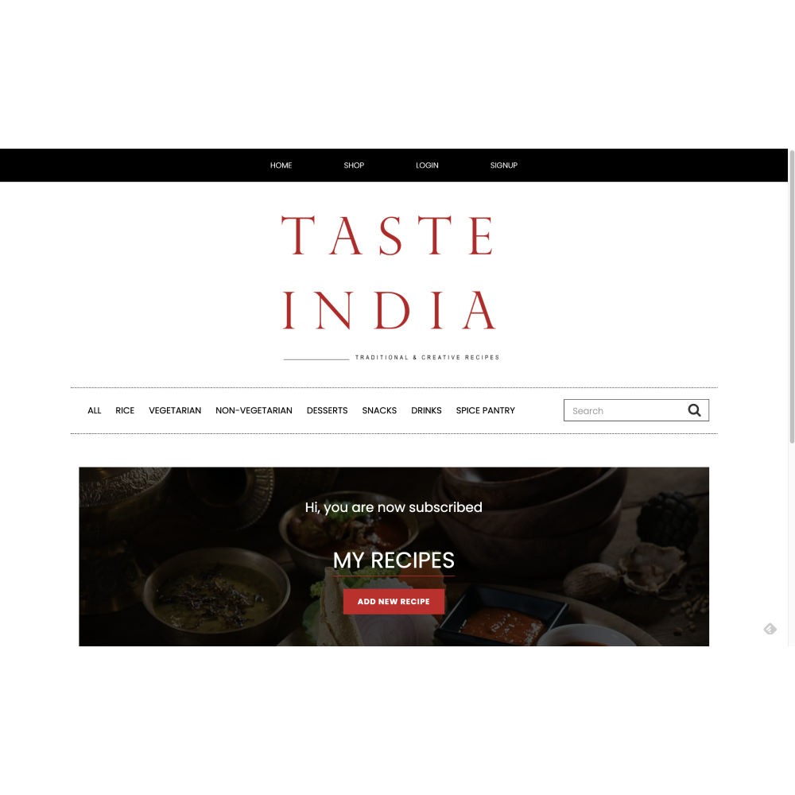
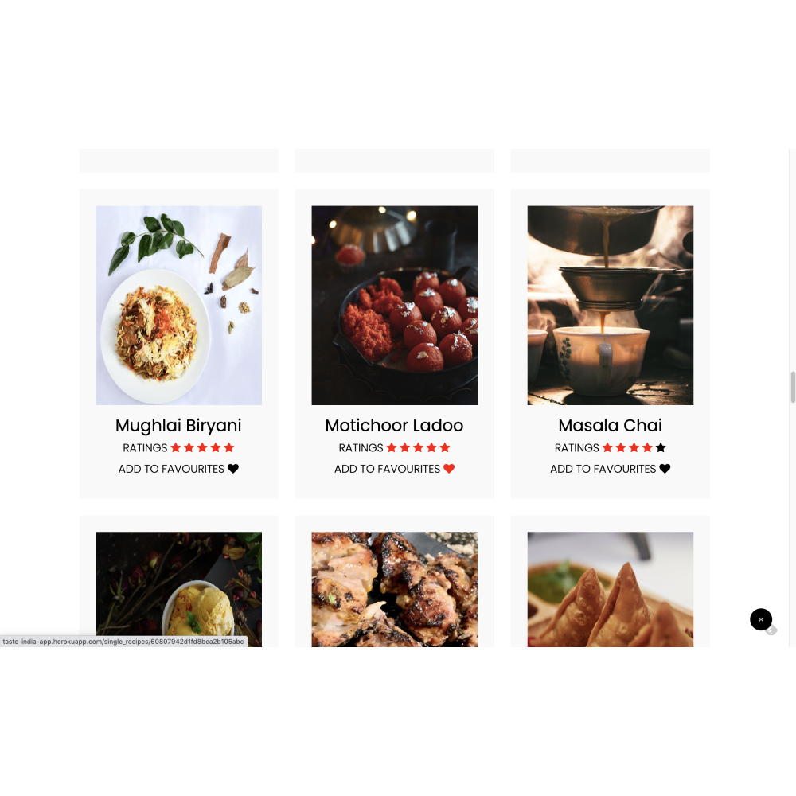

<h1 align="center">
     <a href="https://github.com/FatimasCoding2020/MS3.git" target="_blank"></a>
</h1>
<div align="center">

Taste India is a recipe website that has the secrets of traditional Indian home cooking that is made easy to recreate and will inspire you to cook delicious dishes and incorporate into your menu plan.

Explore the huge selection of recipes in variety of categories which are made easily searchable.

The users can create an account to add, edit and delete and can also rate and add to favourites their saved recipes.

Taste India is designed to easily navigate and is accessible on all devices. 

**Happy cooking**!

[View the live project here](http://taste-india-app.herokuapp.com/)

</div>


## Table of contents

1## Table of contents
1. [UX](#UX)
    1. [Project Goals](#Project-Goals)
    2. [User Stories](#User-Stories)
    3. [Development Planes](#Development-Planes)
2. [Features](#Features) 
    1. [Existing Features](#Existing-Features)
    2. [Features to Implement in the future](#Features-to-Implement-in-the-future)
3. [Technologies Used](#Technologies-Used)
     1. [Main Languages used](#Main-Languages-Used)
     2. [Frameworks, Libraries & Programs Used](#Frameworks-Libraries-&-Programs-Used)
     3. [Testing tools used](#Testing-tools-used)
5. [Testing](#Testing) ☞ **[Testing.md](TESTING.md)**
6. [Deployment](#Deployment)
     1. [Requirements](#Requirements)
     2. [Clone the project](#Clone-the-project)
     3. [Working with the local copy](#Working-with-the-local-copy)
     4. [Heroku Deployment](#Heroku-Deployment)
7. [Credits](#Credits)
     1. [Recipes](#Recipes)
     2. [Media](#Media)
     2. [Code](#Code)
8. [Acknowledgements](#Acknowledgements)
***

***


***

## UX 
### Project Goals
The primary goal of this project is to make a website that is intuitive and easy to navigate and allows users to use the CRUD (create, read, update and delete) functionality for their recipes.This website serves as a platform where users can get inspiration to cook traditional Indian recipes and recreate them.The main requirements were to design, develop and implement the website using **HTML**, **CSS**, **JavaScript**, **Python+Flask** and **MongoDB**.The secondary goals are to sell different kitchen tools and recipe books and access the statistics on dashboard which offers insight into daily inputs.


### User Stories
**As a visitor, I want to:**

-   Easily access the website on desktop, mobile and tablet.
-   Navigate and browse easily through the website that needs no instructions.
-   Explore all recipes and browse different categories.
-   Search recipes by category and select them.
-   Use the search functionality to find easily by recipe name, ingredients and other related keywords.
-   Signup and register, login to access the account profile.
-   Subscribe for a newsletter.
-   Shop for kitchen tools and recipe books.

**As a user, I want to:** 

-   Signup with a username and password to register on the website.
-   Login to my profile to add and access my recipes.
-   Add my own recipes , so they also appear on my account page.
-   Upload recipe images from computer or image links from Google.
-   Edit my recipes to update information of my recipes.
-   Delete my recipes if it is no longer relevant.
-   Rate my recipes, so that I can remember what I thought of it later or to update if I change my opinion.
-   Add to favourites, so that I remember what my favourites are on my account page.
-   Logout of my profile after managing my recipes.

**As a admin, I want to:**

-  Access all goals of visitors, users and also manage different categories.
-  Manage different categories by adding, editing and deleting all recipes.
-  View statistics on dashboard to keep tracks of number of users and recipes.

**Developer / Site Owner Goals:**
The Developer is looking to:
- Create inspiring , easy to use intuitive website where the user can browse, add, edit, delete, rate and add to favourites recipes.
- Demonstrate and improve their proficiency in a variety of software development skills, using newly learned languages, libraries and API’s.
- Deploy a project and have it on their portfolio.


### Development Planes

The **Five Development Planes** explain the functionality of user experience design focusing on user accessibility and friendliness which helps both users and developer achieve their goals.

<strong>1. <u>Strategy</u></strong>

The following three categories helps focus on the following target audiences:

- **Roles:**
     - First time visitors
     - New users
     - Registered users

- **Demographic:**
     - Food enthusiasts
     - Aged 18 years and up
     - Culinarian 

- **Psychographics:**
     - Personalities & Attitudes:
          - Creative
          - Know cookery basics
          - Joyful
          - Easy-going
     - Values:
          - Both modern and traditional lifestyle
          - Holistic thinking
          - Health enthusiast
          - Loves authentic home cooking
     - Lifestyles:
          - Home cooks
          - Hobbyist chefs
          - Food bloggers
          - Cuisine connoisseurs

The **user** will be able to:
- Navigate and browse easily through the website without any instructions
- Select their preferred food category
- Login to create account
- Add and save recipes
- Edit and delete recipes
- Rate and add to favourites their own recipes
- Find recipes using keywords in search functionality
- Subscribe to newsletter
- Connect with developer through social links

The **admin** will be able to:
- Access what users are able to
- Add, edit and delete all recipes on the website
- Communicate with users on social links

A strategy table describes the user and admin goals between importance and feasibility

<div align="center">


</div>

<strong>2. <u>Scope</u></strong>

A scope identifies aligning features with strategy:
- **Content Requirements**
     - The user can find:
          - Appealing and engaging content
          - Easy navigation 
          - Easy search functionality
          - Developer information
- **Functionality Requirements**
     - The user is able to:
          - Navigate to preferred food category
          - Select specific
          - Add or delete their recipe
          - Rate and add to favourites
          - Shop
          - Reach out to the developer and find more information about the website through social links

<strong>3. <u>Structure</u></strong>

The information architecture was organized in a **hierarchial tree structure** so users could navigate through the site with efficiency


The project has collections in the database. The database structure in **MongoDB** is as follows: 


<strong>4. <u>Skeleton</u></strong>

Wireframe mockups were created in a [Balsamiq Workspace](https://www.balsamiq.com/) with providing a positive user experience in mind:

[Add Recipe](assets/wireframes/addrecipe.png)||[Categories](assets/wireframes/categories.png)||[Edit Recipe](assets/wireframes/editrecipe.png)|
|[Home](assets/wireframes/home.png)||[Login](assets/wireframes/login.png)||[My Account](assets/wireframes/myaccount.png)|
|[Recipe](assets/wireframes/recipe.png)||[Shop](assets/wireframes/shop.png)||[Signup](assets/wireframes/signup.png)|
|[Spice Pantry](assets/wireframes/spicepantry.png)||[Terms & Conditions](assets/wireframes/termsconditions.png)|


**Screenshots:**

- Home Page:

     

- Login Page:

     

- Signup Page:

     

- Subscription Page:

     

- Search results Page:

     

- Add recipe Page:

     

- Delete recipe Page:

     

- Rate and add to favourites Page:

     


<strong>5. <u>Surface</u></strong>


- <strong>Colour Scheme</strong>

     - The chosen colour scheme was selected to define the tone of the website.

     - A general palette was created:

          

- **The black colour** is used for navigation bar, a section of the footer, and text. 
- **The gray colour** is used for a section in the footer. In this section the user can sign up for the newsletter and some information is given about the purpose of the website. This section is grey to highlight the section and makes it soften in contrast to the black colour.
- **The red colour** is the logo and underlining of titles and buttons across the website for a bold look.  
- **The white colour** is the background of the body. This white colour makes all content on the body look clear and calm. 

- <strong>Typography</strong>

     - The primary font chosen is [Poppins](https://fonts.google.com/specimen/Poppins). A serif typeface, Poppins is easily readable.


### Existing features 

#### 1. Design 
- An attractive and simple layout with consistency.
- Simple navigation throughout the website by using the navigation bar and menu bar. 
- Showing the recipes clearly.

#### 2. General 
- The index page shows slider images and latest recipes. 
- There are links to the social media platforms at the bottom of the website. 
- Visitors can sign up for the newsletter. 

#### 3. Recipes
- Recipes can be created, read, updated and deleted (CRUD) by the users. 
- Recipes can be sorted by category.
- People can search for recipes using the search functionality. 
- Users have access to their profile, with an overview of all their recipes. 
- Recipes include description, ingredients, instructions, tips, preparation and cooking time and serves.

#### 4. Signup, login and logout 
- People can create a new account on the website. 
- People can login with their existing accounts. 
- People can easily log out.

### Features left to implement in the future 
- Navigation bar consistent after logging in.
- The user can delete their profile.

## Technologies Used

#### Main Languages used
- [HTML5](https://en.wikipedia.org/wiki/HTML5)
    - HTML5 provides the structure and the content for my project. 
- [CSS3](https://en.wikipedia.org/wiki/Cascading_Style_Sheets)
    - CSS3 provides the style of the HTML5 elements.
- [jQuery](https://jquery.com/)
    - jQuery used as the JavaScript functionality.
- [Python](https://www.python.org/)
    - Python provides the backend of the project.

#### Frameworks, libraries & Programs Used
- [Gitpod](https://www.gitpod.io/) 
    - The GitPod is used to develop the project.
- [Git](https://git-scm.com/)
    - The Git was used for version control to commit to Git and push to GitHub.
- [GitHub](https://github.com/)
    - The GitHub is used to host the project.
- [Google Fonts](https://fonts.google.com/)
    - Google Fonts is used to provide the font roboto for all the text that is used in the project. 
- [Balsamiq](https://www.balsamiq.com/)
    - Balsamiq is used to create the mockup designs for the project.
- [MobgoDB](https://www.mongodb.com/1)
    - MongoDB is the fully managed cloud database service used for the project.
- [Heroku](https://dashboard.heroku.com/)
    - Heroku is the cloud platform to deploying the app.
- [Flask](https://flask.palletsprojects.com/en/1.1.x/)
    - Flask is the web framework used to provide libraries, tools and technologies for the app.
- [Jinja](https://jinja.palletsprojects.com/en/2.11.x/)
    - Jinja is used for templating Python
- [Werkzeug](https://werkzeug.palletsprojects.com/en/1.0.x/)
    - Werkzeug is used for password hashing and authentication and autohorization.

#### Testing tools used 
- [Chrome DevTools](https://developers.google.com/web/tools/chrome-devtools/open) is used to detect problems and test responsiveness.
- [Autoprefixer](https://autoprefixer.github.io/)
    - Autoprefixer is used to parse the CSS and to add vendor prefixes to CSS rules. 
- [W3C Markup Validation Service](https://validator.w3.org/)
    - The W3C Markup Validation Service is used to check whether there were any errors in the HTML5 code. 
- [W3C CSS validator](https://jigsaw.w3.org/css-validator/)
    - The W3C CSS validator is used to check whether there were any errors in the CSS3 code.
- [JShint](https://jshint.com/)
    - JShint is a JavaScript validator that is used to check whether there were any errors in the JavaScript code. 
- [PEP8](http://pep8online.com/)
    - The PEP8 validator is used to check whether there were any errors in the Python code.

## Testing

The testing process can be found [here](TESTING.md).

## Deployment

#### Requirements 
- Python3 
- Github account 
- MongoDB account 
- Heroku account

#### Clone the project 
To make a local clone, follow the following steps. 
1. Log in to GitHub and go to the repository. 
2. Click on the green button with the text **“Code”.**
3. Click on **“Open with GitHub Desktop”** and follow the prompts in the GitHub Desktop Application or follow the instructions from **[this link](https://docs.github.com/en/free-pro-team@latest/github/creating-cloning-and-archiving-repositories/cloning-a-repository#cloning-a-repository-to-github-desktop)** to see how to clone the repository in other ways. 

#### Working with the local copy
1. Install all the requirements: Go to the workspace of your local copy. In the terminal window of your IDE type: **pip3 install -r requirements.txt**.
2. Create a database in MongoDB  
    - Signup or login to your MongoDB account.
    - Create a cluster and a database.
    - Create four collections in the db: **categories, recipes, subscribers, users.**
    - Add string values for the collections. See <a href="#ux-architecture">Structure</a> how the database is set up for this project.
3. Create the environment variables 
    - Create a .gitignore file in the root directory of the project.
    - Add the env.py file in the .gitignore.
    - Create the file env.py. This  will contain all the environment variables.
    ```
    Import os
    os.environ.setdefault("IP", "Added by developer")
    os.environ.setdefault("PORT", "Added by developer")
    os.environ.setdefault("SECRET_KEY", "Added by developer")
    os.environ.setdefault("MONGO_URI", "Added by developer")
    os.environ.setdefault("MONGO_DBNAME", "Added by developer")
    ```
4. Run the app: Open your terminal window in your IDE. Type python3 app.py and run the app.

#### Heroku Deployment  
1. Set up local workspace for Heroku 
    - In terminal window of your IDE type: **pip3 freeze -- local > requirements.txt.** (The file is needed for Heroku to know which filed to install.)
    - In termial window of your IDE type: **python app.py > Procfile** (The file is needed for Heroku to know which file is needed as entry point.)
2. Set up Heroku: create a Heroku account and create a new app and select your region. 
3. Deployment method 'Github'
    - Click on the **Connect to GitHub** section in the deploy tab in Heroku. 
        - Search your repository to connect with it.
        - When your repository appears click on **connect** to connect your repository with the Heroku. 
    - Go to the settings app in Heroku and go to **Config Vars**. Click on **Reveal Config Vars**.
        - Enter the variables contained in your env.py file. it is about: **IP, PORT, SECRET_KEY, MONGO_URI, MONGO_DBNAME**
4. Push the requirements.txt and Procfile to repository. 
     ```
    $ git add requirements.txt
    $ git commit -m "Add requirements.txt"

    $ git add Procfile 
    $ git commit -m "Add Procfile"
    ```
5. Deployment: Go to the deploy tab in Heroku and scroll down to **Deploy branch**. Click on **Deploy branch**.

Heroku will receive the code from Github and host the app using the required packages. 
Click on **Open app** in the right corner of your Heroku account. The app will open and the live link is available from the address bar. 


## Credits 

#### Recipes
- [Recipes](https://hebbarskitchen.com/) by Archana hebbar. 
- [Recipes](https://www.archanaskitchen.com/) by Archana.
- [Recipes](https://www.vegrecipesofindia.com/) by Dassana.
- [Recipes](https://www.cookwithmanali.com/ ) by Manali.


#### Media 
- Logo - [Canva](https://www.canva.com/) and [Adobe Illustrator](https://www.adobe.com/)
- Recipe images - Pexels(https://www.pexels.com/nl-nl/)
- Recipe images - Unsplash(https://unsplash.com/)


#### Code
- [Python libraries](https://pypi.org/)
- [Code](https://stackoverflow.com/)
- [W3Schools: HTML, CSS, JS](https://www.w3schools.com/)
- [Devdocs: HTML, CSS, JS](https://devdocs.io/)


## Acknowledgements
- I would like to thank my mentor Precious Ijege for his support and guidance throughout.
- I would like to thank the instructors of [Code Institute.](https://codeinstitute.net/) for the lessons and knowledge.
- I would like to thank Alan from the Tutor Assistance for the advice about a bug.

[Back to top ⇧](#table-of-contents)

***
