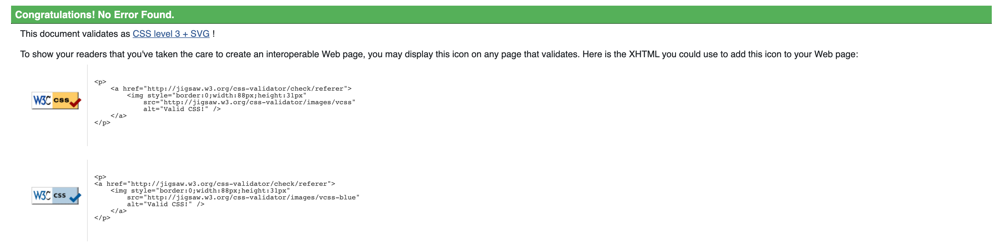
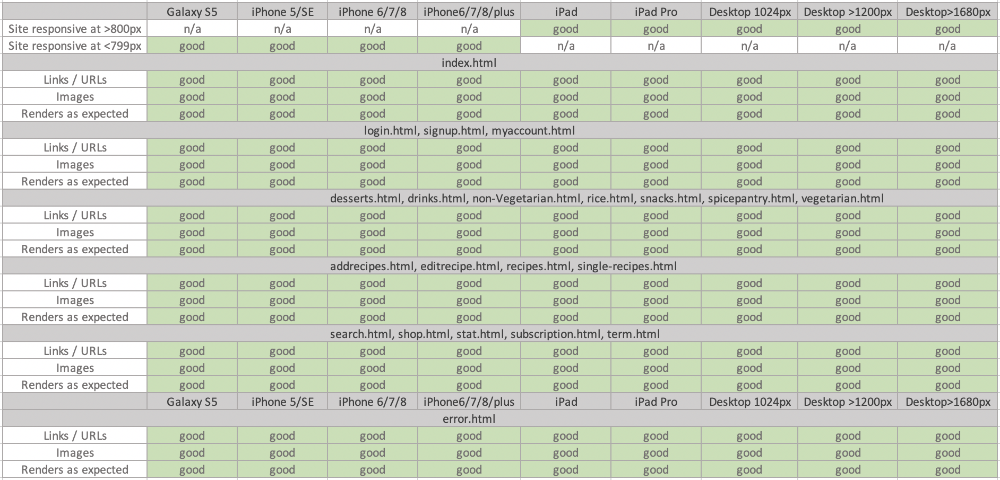

<h1 align="center">Testing</h1>

---

## Index 

- <a href="#validators">1. Code validators</a>
- <a href="#responsiveness">2. Responsiveness</a>
- <a href="#browser-compatibility">3. Browser compability</a>
- <a href="#user-stories">4. Testing user stories </a>
- <a href="#defensive-design">5. Defensive design</a>
- <a href="#bugs">5. Bugs</a>

---

<span id="validators"></span>

## 1. Code validators
 - **[HTML Validator](https://validator.w3.org/):** No errors to show.
    - The html code passed through the validator.

    

- **[CSS Validator](https://jigsaw.w3.org/css-validator/):** No errors found.


- **[JS Hint](https://jshint.com/):** No errors found. 

- **[Python validator | PEP8](http://pep8online.com/):** No errors found


---

<span id="responsiveness"></span>

## 2. Responsiveness 
- Responsiveness of this website is tested with [Chrome DevTools](https://developers.google.com/web/tools/chrome-devtools) and [Responsive Design Checker](https://www.responsivedesignchecker.com/).
- The website is tested on the following devices: 
    - Desktop: 1024px, 1366px, 1440px, 1600px and 1680px. 
    - Mobile & Tablet: Galaxy S5, iPhone 5/SE, iPhone 6/7/8, iPhone 6/7/8 plus, iPhone x, iPad and  iPad Pro



---

<span id="browser-compatibility"></span>

## 3. Browser compatibility


--- 

<span id="user-stories"></span>

## 4. Testing user stories 

### Visitor goals:
1. As a visitor, I want to be able to visit the website on every device- desktop, mobile and tablet. 
    - The visitor can visit the website on a desktop, laptop, tablet and phone.
2. As a visitor, I want to be able to navigate easily through the website to find everything easily. 
    - The visitor can navigate through the website with the navigation bar and menu. The navigation bar is on top of the website. For the mobile visitors there is a hamburger menu. There is a dropdown with the choice to visit all recipes or to go to a specific category. 
3. As a visitor, I want to see an overview of all recipes, so I can get inspired by all recipes.
    - The visitor can visit an overview of all recipes by clicking on All. This page has an an overview of all recipes. 
4. As a visitor, I want to be able to search recipes by categories, so I can quickly scan the recipes by category. 
    - In the menu, the visitor has a choice to visit a specific category. 
5. As a visitor, I want to be able to search recipes based on keywords, so I can find recipes easily.
    - Near the menu there is a search-bar, where visitors can search for words. The search is based on the title of the recipe or the ingredients. 
6. As a visitor, I want to register an account on the website, so I can add my recipes. 
    - The visitor can navigate to the signup page by clicking on signup in the navigation bar.They can easily navigate to the signup form on the website. 
7. As a visitor, I want to sign up for the newsletter. 
    - The visitor can go to the footer to sign up for the newsletter. There is an input field in footer area where the visitor can fill in their email to signup.

### User goals
1. As a user, I want to add my recipes, to view and share my recipes.
    - A user can add recipes on the profile page.  
2. As a user, I want to edit my recipe, so I can update information in the recipe.
    - A user has a profile page with an overview of all recipes made by the user. Each recipe there is an edit button which helps them navigate to add recipe form, where they can edit recipe.
3. As a user, I want to delete my recipe, so I can remove the recipe when it is no longer relevant. 
    - A user can delete a recipe on the profile page where there is an overview of all recipes mede by the site member on the profile page.the user can select their recipe and use the delete button to delete their recipe. 
4. As a user, I want to edit my recipe, so I can update information in the recipe.
    - A user has a profile page with an overview of all recipes made by the user. Each recipe there is an edit button which helps them navigate to add recipe form, where they can edit recipe.
5. As a user, I want to rate my recipes and add them to favourites, so I can remember what I thought of it. 
    - A user can rate and add to favourites their recipe under each recipe they created. 
6. As a user, I want to logout to my profile, so I can logout from my profile. 
    - As a user is logged in they can logout by clicking on logout on navigation bar.
6. As a user, I want to shop, so I can purchase. 
    - As a user want to purchase any utensil or recipe book from shop on navigation bar.


### Admin goals
1. As an admin, I want to add new recipes in specific category, so I can make the categories clear and manageable. 
    - The admin can add new recipes on their profile page and click on add recipe.
2. As an admin, I want to edit recipes, so I can update recipes. 
    - The admin can edit recipes by going to the recipe page and to click on edit recipe.
3. As an admin, I want to delete recipes, so I can remove recipes when they are no longer relevant. 
    - The admin can delete a recipe by going to the recipe page and to click on delete recipe.
4. As an admin, I want to view stats from my profile, so I can know how many users and recipes are there on the website. 
    - As an admin after logged in I can view stats from navigation bar.

---
<span id="defensive-design"></span>

## 5. Defensive design 

1. The user is not able to break the website by clicking on buttons. 

**Answer:** All buttons on the website work. The buttons on the website lead to other pages or to add, edit or delete recipes.

2. The signup form: 
    - 2.1 The username has to be between 5-20 characters only letters and numbers.
    - 2.2 The password has to be between 5-20 characters and must contain at least one number, and one uppercase and lowercase letter.
        
3. The add and edit recipe page:
    - 3.1 The recipe description has to be of maximum 150 characters.
    - 3.2 The category has to be chosen.
    - 3.3 The image URL must be valid.
    - 3.4 The image to be uploaded from computer should be less than 1MB.
    - 3.5 The number of serves and preparation and cooking time has to be entered.
4. By the email subscriber, the email must be in the following order: characters followed by a @ symbol, followed by more characters and then a “.”.

**Answer:** 
The validation of all input fields is done with front end validation and by using the validate functionality. 

- The input fields between a number  of characters. This is done min-length, max-length and the pattern attribute. 
- The input fields have a number of criteria. These criteria where set by the pattern attribute.
- The html type attribute is used to set for example numbers, text, email or url.
- The required functionality is used to make the input fields required. 

See below the input fields for front end validation
    
    ```
    Signup: 
    <input type="text" name="username" class="form-control" id="exampleInputEmail1" aria-describedby="emailHelp" placeholder="Full Name" minlength="5" maxlength="20" pattern="^[A-Za-z0-9_]{5,20}$" required>
    <input type="password" name="password" class="form-control" id="exampleInputPassword1" placeholder="Password" minlength="5" maxlength="20" pattern="^(?=.*\d)(?=.*[a-z])(?=.*[A-Z]).{5,20}$" required>

    Add and edit recipe:
    <textarea name="description" class="form-control" id="formGroupExampleInput" placeholder="" required></textarea> <small class="form-text text-muted">SHORT DESCRIPTION OF MAXIMUM 150 CHARACTERS </small>
    <input type="text" name="imageurl" class="form-control" id="formGroupExampleInput" placeholder="">
    <input type="file" name="imagefile" class="form-control" id="formGroupExampleInput” placeholder="">
    <input type="text" name="preparationtime" class="form-control" id="formGroupExampleInput" placeholder="" required>

    ``` 

5. A recipe can only be deleted with the delete button, the modal will appear with a confirmation if the user is sure to delete the recipe.

**Answer:** If the user clicks on the delete button, a modal will pop up with the text: Are you sure you want to delete (recipe name)?. If the user clicks then the recipe will be deleted from the database.

--- 

<span id="bugs"></span>

## 6. Bugs | Solved
1. A bug was found by running the project. I found the preparation time was showing the title of the recipe. 
    - I solved this by setting the preparationid in app.py.
2. A bug was found in rating and add to favourites.
    - I have solved this problem by correcting the checked and not checked feature in my account.html file.
3. A bug was found in subscription if the registered user tries to subscribe again
    - I have solved this problem by adding the message = "Hi, you are already subscribed" in app.py.


---

[Go to README.md file](README.md).
